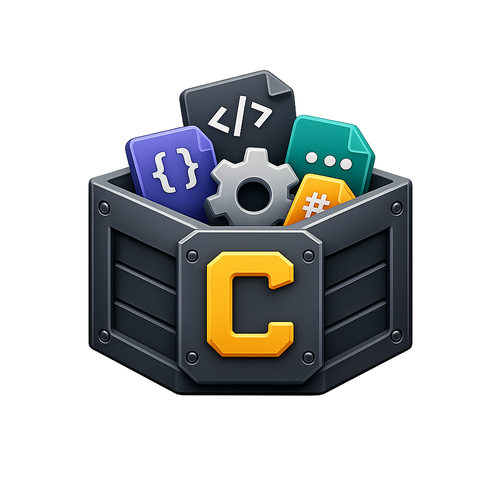

# Crate

<p align="center">
  
</p>

<h3 align="center">Crate</h3>

<p align="center">
  Personal dev toolbox — an all-in-one desktop utility app built with Tauri + Vue 3. No backend required. All data stored locally via file-based storage.
</p>

<p align="center">
  
  
  
  
  
</p>

---

Personal dev toolbox — an all-in-one desktop utility app built with Tauri + Vue 3. No backend required. All data stored locally via file-based storage.

## Stack

- **Tauri v2** — Desktop runtime with filesystem access
- **Vue 3** — Composition API + `<script setup>`
- **Tailwind CSS v4** — Utility-first styling
- **Pinia** — State management
- **highlight.js** — Syntax highlighting with line numbers
- **@purdia/ui** — Internal component library (45+ components)
- **@purdia/theme** — Dark/light mode + color switching
- **@purdia/toast** — Notification system
- **Lucide Icons** — Icon set

## Features

- Sidebar navigation with collapsible category submenus and flyout menus (collapsed mode)
- Command palette (Ctrl+K) for quick tool search
- Dark/light theme toggle
- Favorites and recent history (persisted to file)
- One-click copy on all outputs with toast notifications
- Breadcrumb navigation
- Syntax-highlighted code output with line numbers
- Searchable select dropdowns (BaseSelect)
- File-based settings storage (`$APPDATA/crate/`)

## Tools (40+)

### Formatters
- JSON Formatter
- XML Formatter
- SQL Formatter
- HTML Formatter
- CSS Formatter
- JS/TS Formatter
- YAML Formatter
- TOML Formatter

### Generators
- UUID Generator (v4)
- NanoID Generator
- Password Generator
- JWT Decoder
- JWT Generator (unsigned/testing)
- Hash Generator (SHA-1, SHA-256, SHA-384, SHA-512)
- HMAC Generator
- Lorem Ipsum

### Date & Time
- Timestamp Converter (Unix <> Human)
- Timezone Converter
- Cron Parser

### Encoding
- Base64 Encode/Decode
- URL Encode/Decode
- HTML Entities Encode/Decode
- Unicode Escape/Unescape

### Data
- JSON <> YAML
- CSV <> JSON
- JSON Diff
- JSONPath Tester

### Network
- Domain & IP WHOIS Lookup (RDAP)
- Network Speed Test (Download/Upload/Latency/Jitter)
- IP Location (Geolocation)
- Network Information (Connection details, browser info)

### Dev Helpers
- Regex Tester
- HTTP Status Code Lookup
- MIME Type Lookup
- Color Converter (HEX/RGB/HSL)
- Number Base Converter
- Case Converter (camelCase, snake_case, kebab-case, PascalCase)
- Diff Checker
- Word Counter
- Markdown Preview

## Development

```bash
# Install dependencies
npm install --legacy-peer-deps

# Build internal packages
npm run build --workspace=packages/theme
npm run build --workspace=packages/toast
npm run build --workspace=packages/ui

# Start dev server (frontend only)
npm run dev

# Start Tauri dev (full desktop app)
npm run tauri dev
```

## Build

```bash
npm run tauri build
```

## Project Structure

```
src/
  components/     # App shell components (sidebar, topbar, layout)
  composables/    # Shared composables (useCopy)
  data/           # Tool registry
  layouts/        # App layout
  router/         # Vue Router config
  services/       # File-based storage service
  stores/         # Pinia stores
  views/          # Pages and tool views
packages/
  ui/             # @purdia/ui component library
  theme/          # @purdia/theme (dark/light + colors)
  toast/          # @purdia/toast (notifications)
  tailwind/       # CSS theme tokens
  ...
src-tauri/        # Tauri backend (Rust)
```

## License

MIT
